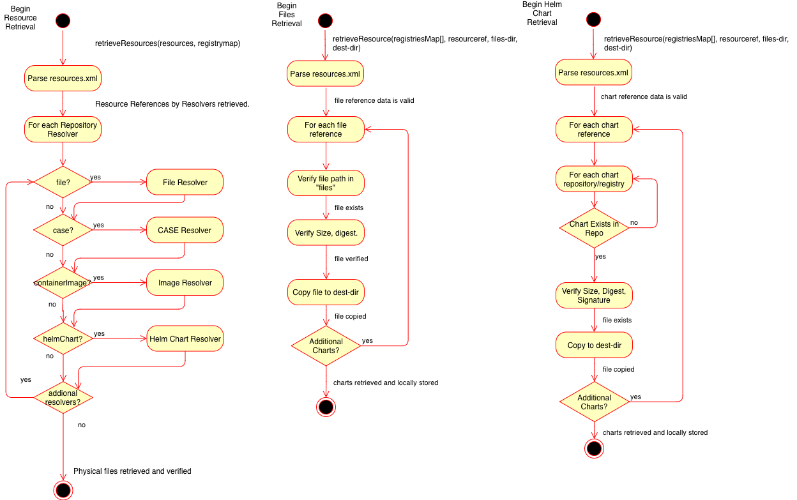

# CASE resources.yaml Specification
- [CASE resources.yaml Specification](#case-resourcesyaml-specification)
  - [Status: Stable](#status-stable)
  - [Overview](#overview)
  - [`resources.yaml` Specification](#resourcesyaml-specification)
  - [CASEs](#cases)
  - [Helm Charts](#helm-charts)
  - [Container Images](#container-images)
    - [Single platform Image](#single-platform-image)
    - [Multiple Platform Image List](#multiple-platform-image-list)
    - [Registries](#registries)
    - [Operator Catalog Images](#operator-catalog-images)
    - [Operator Bundle Images](#operator-bundle-images)
    - [Container Image Groups](#container-image-groups)
  - [Media Types](#media-types)
  - [Specifying Version Ranges for Helm Charts and CASEs](#specifying-version-ranges-for-helm-charts-and-cases)
    - [Which resources can specify ranges?](#which-resources-can-specify-ranges)
    - [Non-functional CASE versions](#non-functional-case-versions)


## Status: Stable

## Overview
The `resources.yaml` includes references to specific resources that are included with a CASE inventory item.

A resource describe either an entity in a repository, such as a Docker Image, or an embedded file, such as a YAML file.  The `resources` object includes a set of Repository Resolver objects, which each have repository-specific parameters that define the resource.  The Repository Resolver includes the portable information required to locate a file.  The physical location (web site, local docker registry, etc) is defined separately (e.g. in the Installer).

For embedded `files`, the `files` subdirectory must be used to store files within the CASE inventory item.  These items can include nested directories and are referenced using a path relative to the files directory.

The resolvers described below are:
* `cases`: Other CASEs included with this inventory item.  CASEs can be referenced as a pre-requisite or part of the item inventory (here).  By including them in the inventory, they are considered PART of the workflow and included in the certification of the CASE.
* `containerImages`: Container images for this inventory item. This includes both the container images needed to install the inventory item as well as container images that may be used by the inventory item. For example, a Kubernetes Operator needs an image for the Operator's controller, but that controller may create additional Pods using one or more different images. All images in question must be included in the `containerImages` resolver.
* `helmCharts`: Helm Charts included with this inventory item.


Example Resolver to Registry mapping (not part of this specifiction):

| Resolver| Media Type | Repositories/Registries |
| --------| ---------- | ------------------- |
| cases | application/vnd.case.core.v1 | https://raw.githubusercontent.com/IBM/cases/master/repo/stable |
| cases | application/vnd.case.core.v1 | https://raw.githubusercontent.com/IBM/cases/master/repo/community |
| containerImages | application/vnd.oci.image.manifest.v1 | https://quay.io |
| helmCharts | application/vnd.case.resource.helm.chart.v1 | https://raw.githubusercontent.com/IBM/cases/master/repo/community |

This diagram illustrates how a Resource Resolver can use the Mapping to retrieve and validate the inventory item resources:


## `resources.yaml` Specification
The `resources.yaml` has the following attributes:
* `resources`: The resources object. (required)
  * `metadata`:  Information about the resources.
  * `resourceDefs`: The resource resolvers.
    * **cases**: Array of CASE references.
      * `metadata`:  Metadata about the CASE reference.
      * `case`: The case name.
      * `version`:  The version of the case or a range of acceptable versions.
      * `appSemver`: The semantic version of the application represented by the CASE. This should be reflected everywhere including the JSON.
      * `repositoryURLs`:  The URLs of the CASE repositories (includes mirrors). (array of strings)
      * `mediaType`: One of:
        * application/vnd.case.core.v1
    * **containerImages**: Array of container image config reference resolvers.
      * `metadata`:  Metadata about the image reference.
        * `operators_operatorframework_io`: # Metadata specific for Operator Framework Images.
        *    `catalog`: # Identifies this as an Operator Catalog Image.  There can only be one of these per CASE.
        *      `mediaType`: "registry+v1"  # The `operator-registry` spec, version 1 of the catalog index image format.
        *    `bundle`:  # Identifies this as an Operator Bundle Image.
        *      `mediaType`: "registry+v1"  # The `operator-registry` spec, version 1 of the catalog index image format.
      * `image`: The name of the image in `<namespace name>/<image name>` format. (required)
      * `tag`: The tag for this version of the image. (either tag or digest is required)
        * If no tag is specified, it is assumed to be `latest`
      * `digest`: The [OCI Digest](https://github.com/opencontainers/image-spec/blob/master/descriptor.md#digests) of the file.  (either tag or digest is required)
        * Supported algorithms include: [SHA-256](https://github.com/opencontainers/image-spec/blob/master/descriptor.md#sha-256)
      * `mediaType`: One of (required):
        * application/vnd.oci.image.manifest.v1
        * application/vnd.docker.distribution.manifest.v2
        * application/vnd.docker.distribution.manifest.v1
        * application/vnd.oci.image.index.v1
        * application/vnd.docker.distribution.manifest.list.v2
      * `platform`: The platform that the image supports. (required if image is specific to single platform)
        * `architecture`: The architecture the image supports. (required)
        * `os`: The operating system the image supports. (required)
        * `variant`: The variant of the CPU, for example v8 to specify a particular CPU variant of the 64-bit ARM CPU.
      * `manifests`: List of manifests for platform specific images. (required if the top level image is referencing a manifest list aka "fat-manifest")
        * `digest` : The [OCI Digest](https://github.com/opencontainers/image-spec/blob/master/descriptor.md#digests) of the file. (required)
            * Supported algorithms include: [SHA-256](https://github.com/opencontainers/image-spec/blob/master/descriptor.md#sha-256)
        * `mediaType`: One of (required):
          * application/vnd.oci.image.manifest.v1
          * application/vnd.docker.distribution.manifest.v2
          * application/vnd.docker.distribution.manifest.v1
          * application/vnd.oci.image.index.v1
        * `platform`: The platform that the image supports. (required)
            * `architecture`: The architecture the image supports. (required)
            * `os`: The operating system the image supports. (required)
            * `variant`: The variant of the CPU, for example v8 to specify a particular CPU variant of the 64-bit ARM CPU.
        * `tag`: The tag for this version of the image. (either tag or digest is required)
          * If no tag is specified, then it is assumed to be of the format `<parent-tag>-<os>-<arch>[-variant]`
      * `registries`:  An array of image repository mirror objects. (at least one is required)
        * `host`:  The host and optional port in the format `host[:port]`.  Example: `dockerhub.io` or `dockerhub.io:443` (required)
    * **helmCharts**: Array of Helm chart reference resolvers.
      * `metadata`:  Metadata about the Helm Chart reference.
      * `chart`: The name of the Helm chart.
      * `version`:  The version of the chart or a range of acceptable versions.
      * `repositoryURLs`:  The URLs of the Helm repositories (includes mirrors) (array of strings)
      * `mediaType`: One of:
        * application/vnd.case.resource.helm.chart.v1
        * application/vnd.case.resource.helm.chart.v2
        * application/vnd.case.resource.helm.chart.v3
    * **files**:  Array of file object references that are embedded in this CASE inventory item.
      * `metadata`:  Metadata about the file reference.
      * `ref`:  The relative path to the `files` directory.
      * `mediaType`:  The media type of the file as supported by this spec.  See [Media Types](#Media-Types).

## CASEs
CASEs are referenced in the `cases` resource definitons section:

Example:
```yaml
resources:
  ...
  resourceDefs:
    cases:
      - case:  mysql
        version: 1.3.1
        repositoryURLs:
          - https://raw.githubusercontent.com/IBM/cases/master/repo/community
        mediaType: application/vnd.case.core.v1
```


## Helm Charts
Helm charts are referenced in the `helmCharts` resource definitions section:

Example:
```yaml
resources:
  ...
  resourceDefs:
    helmCharts:
      - chart:  mysql
        version: 1.3.1
        repositoryURLs:
          - https://kubernetes-charts.storage.googleapis.com
        mediaType: application/vnd.case.resource.helm.chart.v1
```

The resolver will connect to the `repositoryURL` and retrieve or validate version 1.3.1 of the `mysql` chart.

## Container Images

Container images are now referenced in the `containerImages` resource definitions section:

DEPRECATED: Using `files/manifest.yaml` to reference image is being deprecated in favor of `containerImages`

### Single platform Image

When referencing single platform image:
* one of the following `mediaType` is required:
  * [application/vnd.oci.image.manifest.v1](https://github.com/opencontainers/image-spec/blob/master/manifest.md#image-manifest)
  * [application/vnd.docker.distribution.manifest.v2](https://github.com/docker/distribution/blob/master/docs/spec/manifest-v2-2.md#image-manifest-field-descriptions)
  * [application/vnd.docker.distribution.manifest.v1](https://docs.docker.com/registry/spec/manifest-v2-1/)
* The `platform` property is required.

Note: `application/vnd.oci.image.manifest.v1` is not yet widely adopted and `application/vnd.docker.distribution.manifest.v1` does not preserve digest when transfering, so we recommend using `application/vnd.docker.distribution.manifest.v2`.

```yaml
containerImages:
  - image: nginx_amd64
    mediaType: application/vnd.docker.distribution.manifest.v2
    tag: 1.17.6
    digest: sha256:a322661f7bd7c05fd085975d0f10bb6c593ac2d142321e895cfd737f7d7deac3
    platform:
      architecture: amd64
      os: linux
    registries:
      - host: docker.io
  - image: calico/node
    mediaType: application/vnd.docker.distribution.manifest.v2
    tag: master-amd64
    digest: sha256:c2f352b7b46fe56a2cc6ef76bdfb490972a02ac40c1fc505ac43be865a59665b
    platform:
      architecture: amd64
      os: linux
    registries:
      - host: quay.io
```

### Multiple Platform Image List

When referencing a manifest list _(aka "fat manifest")_ which points to specific image manifests for one or more platforms:
* one of the following `mediaType` is required:
  * [application/vnd.oci.image.index.v1](https://github.com/opencontainers/image-spec/blob/master/image-index.md)
  * [application/vnd.docker.distribution.manifest.list.v2](https://github.com/docker/distribution/blob/master/docs/spec/manifest-v2-2.md#manifest-list)
* The `manifests` property is required.

Note: `application/vnd.oci.image.index.v1` is not yet widely adopted, so we recommend using `application/vnd.docker.distribution.manifest.list.v2`.

```yaml
containerImages:
  - image: nginx
    metadata:
      name: nginx
      displayName: nginx 1.17.6
    tag: 1.17.6
    digest: sha256:50cf965a6e08ec5784009d0fccb380fc479826b6e0e65684d9879170a9df8566
    mediaType: application/vnd.docker.distribution.manifest.list.v2
    manifests:
      - digest: sha256:a322661f7bd7c05fd085975d0f10bb6c593ac2d142321e895cfd737f7d7deac3
        mediaType: application/vnd.docker.distribution.manifest.v2
        tag: 1.17.6-ppc64le
        platform:
          architecture: ppc64le
          os: linux
      - digest: sha256:189cce606b29fb2a33ebc2fcecfa8e33b0b99740da4737133cdbcee92f3aba0a
        mediaType: application/vnd.docker.distribution.manifest.v2
        tag: 1.17.6-amd64
        platform:
          architecture: amd64
          os: linux
      - digest: sha256:f5dc44557f1d666381791c3d01300d64899ba7b74dc26f4d681bd1827caf61ca
        mediaType: application/vnd.docker.distribution.manifest.v2
        tag: 1.17.6-s390x
        platform:
          architecture: s390x
          os: linux
      - digest: sha256:189cce606b29fb2a33ebc2fcecfa8e33b0b99740da4737133cdbcee92f3aba0a
        mediaType: application/vnd.oci.image.manifest.v1
        tag: 1.17.6-arm64-v8
        platform:
          architecture: arm64
          os: linux
          variant: v8
    registries:
      - host: docker.io
```

### Registries

Registries can contain a list of registry addresses from where the image can be located. If empty, the source registry is assumed to be [docker hub](https://hub.docker.com/).

Examples:

```yaml
    registries:
      - host: docker.io
      - host: myregistry.mycompany.com
```

NOTE: If more than one registry is provided, the image digest MUST NOT change between registries. Mirrored registries and tools like [skopeo](https://github.com/containers/skopeo) support copying images and manifests without changing digests.

### Operator Catalog Images
The [Operator Framework](https://github.com/operator-framework) uses [Operator Catalog Images](https://github.com/operator-framework/olm-book/blob/master/docs/glossary.md) (or OLM Index Images) to describe a set of operator and update metadata that can be installed onto a cluster via OLM.

See the [operator-registry](https://github.com/operator-framework/operator-registry) git repository and [OLM design doc](https://github.com/operator-framework/operator-lifecycle-manager/blob/master/doc/design/how-to-update-operators.md) for details.

To identify an Operator Catalog Image, add the additional metadata to the `containerImage` image reference:
```
containerImages:
  - image: nginx-catalog
    tag: latest
    digest: sha256:284afe487aa9f43074e4d7c9b0a339d25335649ceca193c1c7b43e3908e94dd0
    metadata:
      operators_operatorframework_io:
        catalog: 
          mediaType: "registry+v1"
```

### Operator Bundle Images
The [Operator Framework](https://github.com/operator-framework) uses [Operator Bundle Images](https://github.com/operator-framework/olm-book/blob/master/docs/glossary.md) to identify a single version of an Operator.  These are currently `scratch` images that have the OLM artifacts that make-up an Operator, including the channel information of that operator and other metadata.  

An Operator Bundle Image is used by the Operator Package Manager ([opm](https://github.com/operator-framework/operator-registry)) tool to build Operator Catalog Images.

```
containerImages:
  - image: nginx-bundle
    tag: 0.9.4
    digest: sha256:b4e9ee00d392b8a5f97f8fda23e1eb7763408ff560d5a141f9a2b874ae6b14d1
    metadata:
      operators_operatorframework_io:
        bundle: 
          mediaType: "registry+v1"
```

### Container Image Groups

The container image groups field allows a CASE to define a set of group labels for the images.  This is a metadata labeling mechanism that allows images to be grouped together into buckets.  

```yaml
containerImages:
  - image: nginx-bundle
    tag: 0.9.4
    digest: sha256:b4e9ee00d392b8a5f97f8fda23e1eb7763408ff560d5a141f9a2b874ae6b14d1
    groups:
      demo: {}
      production: {}
      smallSizing: {}
    metadata:
      operators_operatorframework_io:
        bundle: 
          mediaType: "registry+v1"
```

```yaml
containerImages:
  - image: nginx-bundle
    tag: 0.9.4
    digest: sha256:b4e9ee00d392b8a5f97f8fda23e1eb7763408ff560d5a141f9a2b874ae6b14d1
    groups: {} # Note that an image with no groups declared belongs to no groups
               # this means that this image does not belong to any image grouping
    metadata:
      operators_operatorframework_io:
        bundle: 
          mediaType: "registry+v1"
```

## Media Types
The following media types are supported by this CASE specification:
* application/vnd.case.core.v1:  A CASE.
* application/vnd.case.resource.helm.chart.v1:  A Helm Chart.
* application/vnd.case.resource.helm.chart.v2:  A Helm Chart using Helm 2 formatting.
* application/vnd.case.resource.helm.chart.v3:  A Helm Chart using Helm 3 formatting.
* application/vnd.case.resource.olm.package.v1: An Operator Lifecycle Manager (OLM) Package.
* application/vnd.case.resource.k8s.v1+yaml: A [Kubernetes YAML](https://kubernetes.io/docs/concepts/overview/working-with-objects/kubernetes-objects/) resource.
* application/vnd.case.resource.script.bash.v1:  A Bourne shell script compatible with bash 3.x
* application/vnd.case.resource.image.manifest.v1: An [IBM Cloud offline package manifest.yaml](https://www.ibm.com/support/knowledgecenter/en/SSBS6K_3.2.0/app_center/add_package_offline.html).
* application/vnd.oci.image.manifest.v1:  An OCI v1 container image manifest in JSON format.
* application/vnd.docker.distribution.manifest.v1: A Docker v1 container image manifest in JSON format.
* application/vnd.docker.distribution.manifest.v2: A Docker v2 container image manifest in JSON format.
* application/vnd.oci.image.index.v1 : An OCI v1 list of image manifests in JSON format.
* application/vnd.docker.distribution.manifest.list.v2 : A Docker v2 Manifest list _(aka “fat manifest”)_ in JSON format.

Other well known media types can be used to identify files that the CASE has not formally defined.  Many of these types are documented in these locations:
* [IANA Media Types](https://www.iana.org/assignments/media-types/media-types.xhtml)
* [Mozilla Mime Types](https://developer.mozilla.org/en-US/docs/Web/HTTP/Basics_of_HTTP/MIME_types/Complete_list_of_MIME_types)
* [text/markdown](https://tools.ietf.org/html/rfc7763)
* text/x-shellscript:  Use for general shell scripts when the actual script type isn't specifically known (zsh, bourne, csh, etc)
* text/x-sh:  Use for general bourne shell scripts when the required version of bash isn't known.

## Specifying Version Ranges for Helm Charts and CASEs
A `Range` is a set of conditions that specify which versions satisfy the prerequisite. This specification utilizes basic comparisons and standard AND/OR logic to define the expected version range.

A CASE reference supports both a CASE `version` and application `appSemver` version ranges.  When both are specified, both constraints are ANDed together.

The basic comparisons are:

<table>
    <tr>
        <td>=</td>
        <td>equal</td>
    </tr>
    <tr>
        <td>!=</td>
        <td>not equal</td>
    </tr>
    <tr>
        <td>></td>
        <td>greater than</td>
    </tr>
    <tr>
        <td><</td>
        <td>less than</td>
    </tr>
    <tr>
        <td>>=</td>
        <td>greater than or equal</td>
    </tr>
    <tr>
        <td><=</td>
        <td>less than or equal</td>
    </tr>
</table>

Basic comparisons are combined into logical AND and OR combinations. ANDs are specified with spaces between comparison objects and ORs are specified with the standard double-pipe character: `||`. Logical AND is given higher priority than OR and parenthesis are not supported.

Examples:
* This example will support any v1.x version above or equal to 1.11.3:
  * `>=1.11.3 <2`
* This example will support either versions 1.x through 2.x or versions 3.4.0 and above
  * `>= 1.0 <3.0.0 || >= 3.4.0`
* To support any version other than 2.11.2:
  * `<2.11.2 || >2.11.2` or, more simply:
  * `!=2.11.2`
  


### Which resources can specify ranges?

Helm Chart versions and CASE `version`s and `appSemver`s can be specified as ranges in resources.yaml since they follow Semantic versioning. Container images cannot specify ranges because digests and tags do not follow a versioning standard.

### Non-functional CASE versions

As stated in the [case.yaml specification](100-case.md#version), CASE supports non-functional versions. These are specified after the standard version and are prefixed with a plus sign (`+`). In order of preference, non-functional versions come after a standard release. For example, `1.0.0 < 1.0.0+20191008.162055`.
