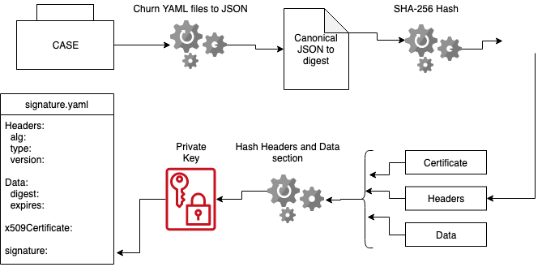

# CASE signature.yaml Specification

- [CASE signature.yaml Specification](#case-signatureyaml-specification)
  - [Status: Stable](#status-stable)
  - [Overview](#overview)
  - [Specification](#specification)
    - [What needs to be Signed](#what-needs-to-be-signed)
    - [How can we Avoid Hash Problems?](#how-can-we-avoid-hash-problems)
    - [Workflow for Signing the CASE](#workflow-for-signing-the-case)
    - [Signature Validation](#signature-validation)

## Status: Stable

## Overview

Our digital signature strategy is an adaptation of the [JWT](https://jwt.io/introduction/) method of signing a payload.  The signature provides a way to validate that the CASE downloaded is the CASE that was certified.  There are four parts to the signature: the header, the data, the x509Certificate, and the signature.

## Specification

The `signature.yaml` has the following attributes:

* `headers`: Signature header. (Required)
  * `alg`: The algorithm used to encrypt the signature. (Required)
  * `version`: The version of the CASE specification. (Required)
* `data`: The information to be verified upon delivery. (Required)
  * `digest`: A SHA-256 digest of the canonical JSON version of the CASE. (Required)
* `x509Certificates`: An array of certificates used for decrypting the signature. (Required)
  * `chain`: The certificate chain. (Required)
  * `certificate`: The base64 encoded certificate. (Required)
* `signature`: The digital signature. (Required)

### What needs to be Signed
All JSON files included in this specification's canonical JSON will be signed. Any additional non-YAML files (resource files, licenses, readmes) are included via their digest found in digests.yaml.

For example:
```
my-case/                            
  case.yaml              
  prereqs.yaml           
  qualification.yaml     
  certification.yaml     
  digests.yaml           
  README.md              
  roles.yaml             
  inventory/                       
    <item>/                         
      inventory.yaml     
      actions.yaml       
      README.md          
      resources.yaml     
      files/
        <file>           
  signature.yaml
```

In the above example, all yaml files will included in the signature via the canonical JSON file while the README.md files and the items in the files directory will be included indirectly via their entry in digests.yaml. 

### How can we Avoid Hash Problems?

In order to avoid hashing problems there needs to be a canonical form for the data.  The format chosen is canonical JSON.  YAML files are converted into a single canonical JSON file and then that file is hashed to produce the signature.

### Workflow for Signing the CASE



Steps involved:

1. Concatonate all YAML files into a single file.
2. Convert this file to be a canonical JSON form file.
3. Create a digest of the canonical using SHA-256 encoding.
4. Add this digest to the data property of `signature.yaml`.
5. Create a hashsum of the headers, digest, expiration date, and x509 certificates. This is the signature.
6. Add this signature to `signature.yaml`.    

### Signature Validation

We will use the PKI method for validating the signature.  This means that a Public / Private key is needed to sign the CASE digest.

The receiver installs the CASE and verifies the digital signature.  This is done by using the public key to decrypt the digital signature (giving the original digest of the content).  The content in the CASE is then hashed using SHA-256, and the resulting values are compared.  If they are a match then the content the reciever has is the same as the content the server sent.  The public key is read by the receiver through the signature.yaml file in the x509Certificate section.
