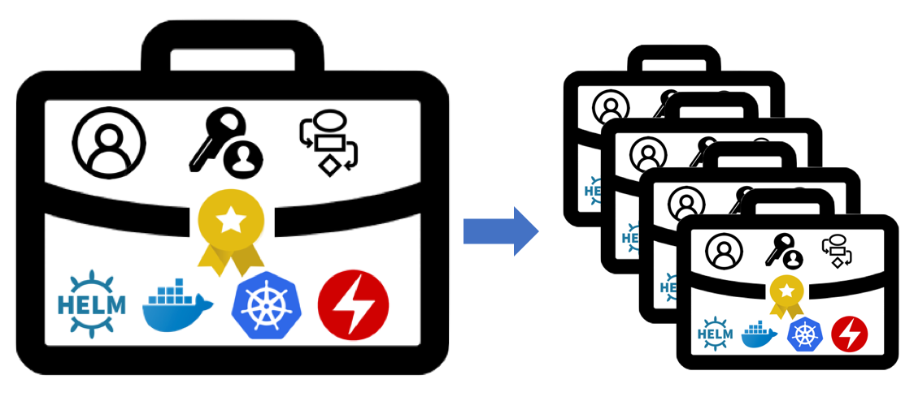

# CASE Specification
<p align="center">
  
</p>

The Container Application Software for Enterprises (CASE) specification defines metadata and structure for packaging a containerized application. CASE provides a common packaging definition for the many ways to install, manage, operate, upgrade, and uninstall complex software using multiple roles and personas. It provides the flexibility to allow both simple and tailored use cases with a transparent and obvious security posture.

### The specification includes
- Definition and specification of CASE artifacts
- Deployment/Installation of CASE artifacts
- Operation of CASE artifacts
- Multi-persona activities
- Authenticity and Integrity of a CASE
- Compatibility with Out of scope work (futures)
- Extensibility
- Assembly of a CASE into a single file, archive or package for storage and transport

### Out of scope
- Storage of a CASE
- Transfer of a CASE 
- Entitlement of a CASE
- Catalog / Display of CASEes

See the [CASE Specification Index](000-index.md) for the specification documentation.

## Specification Status and Schedule
**This specification is in beta and is updated regularly.**

The master branch contains the live code changes for the NEXT version.  See branches for snapshots of previous versions.

**Specification Version:  v1.1.0**

## Setting up Microsoft Visual Studio Code for Intellisense
[Microsoft Visual Studio Code](https://code.visualstudio) with some extensions can simplify and validate building the CASE yaml files.

To configure your VS Code project to use CASE YAML validation:
1. Install the [Red Hat YAML extension](https://marketplace.visualstudio.com/items?itemName=redhat.vscode-yaml).
2. Clone this repository into a peer git repo to your project:  
   `git clone https://github.com/ibm/case`

3. Create a soft-link to the `schemas` directory from this project into your own project:
   ```
   cd myrepo
   ln -s ../case/schemas
   ```
4. Copy the `.vscode/settings.json` folder/file from this project into your own project. This will add the correct mappings to support the CASE JSON schema files included in this project.
